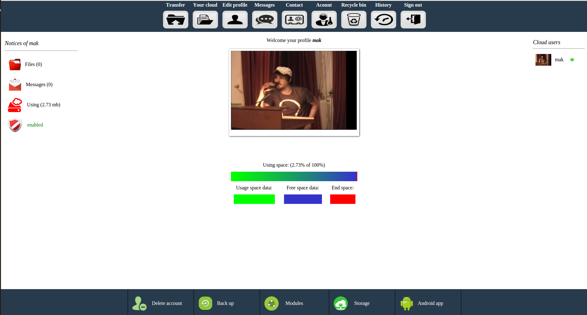

# core

Makbox core for web server (upload, share, etc.)
  
    

Installation  

1) Modify yoyr server file  
for http server:  
change the files /etc/apache2/sites-available/000-deafult.conf   
and replace with this   

<VirtualHost *:80>  

        ServerAdmin webmaster@localhost  
	       ServerName localhost:80   
        DocumentRoot /var/www/makbox   

    <Directory "/var/www/makbox/shared">  
     AllowOverride AuthConfig   
     Order allow,deny    
     Allow from all   
    </Directory>   

	ErrorLog ${APACHE_LOG_DIR}/makbox_error.log   
	CustomLog ${APACHE_LOG_DIR}/makbox_access.log combined   

 CustomLog ${APACHE_LOG_DIR}/cook.log enhance   

<FilesMatch "\.(cgi|shtml|phtml|php)$">   
				SSLOptions +StdEnvVars   
		</FilesMatch>     
		<Directory /usr/lib/cgi-bin>   
				SSLOptions +StdEnvVars   
		</Directory>   

</VirtualHost>    

for https server   

<VirtualHost *:443>  

        ServerAdmin webmaster@localhost  
	      ServerName localhost:443   
      	DocumentRoot /var/www/makbox   

    <Directory "/var/www/makbox/shared">   
     AllowOverride AuthConfig   
     Order allow,deny    
     Allow from all   
    </Directory>   

	ErrorLog ${APACHE_LOG_DIR}/makbox_error.log   
	CustomLog ${APACHE_LOG_DIR}/makbox_access.log combined   

 CustomLog ${APACHE_LOG_DIR}/cook.log enhance   
 
  SSLEngine on   
  SSLCertificateFile /etc/apache2/ssl/your_key.crt   
  SSLCertificateKeyFile /etc/apache2/ssl/yoyr_key.key  
  SSLCertificateChainFile /etc/apache2/ssl/yoyr_key_bundle.crt  
  
SSLProtocol all -SSLv2 -SSLv3  
SSLHonorCipherOrder on   
SSLCipherSuite "EECDH+ECDSA+AESGCM EECDH+aRSA+AESGCM EECDH+ECDSA+SHA384 \  
EECDH+ECDSA+SHA256 EECDH+aRSA+SHA384 EECDH+aRSA+SHA256 EECDH+aRSA+RC4 \  
EECDH EDH+aRSA RC4 !aNULL !eNULL !LOW !3DES !MD5 !EXP !PSK !SRP !DSS"  

 SSLCompression off  

<FilesMatch "\.(cgi|shtml|phtml|php)$">   
				SSLOptions +StdEnvVars   
		</FilesMatch>   
		<Directory /usr/lib/cgi-bin>   
				SSLOptions +StdEnvVars   
		</Directory>   

 </VirtualHost>    

2) Download core   

3) Make a direcory into /var/www   
   direcory must be have name makbox   
   Right: /var/www/makbox   
  
4) unzip the core into /var/www/makbox   

5) cut all files from sumbolder /var/www/makbox/core and copy into folder /var/www/makbox   
   delete subfolder core   

 
6) OPen your borowser and follow the steps for install makbox   

